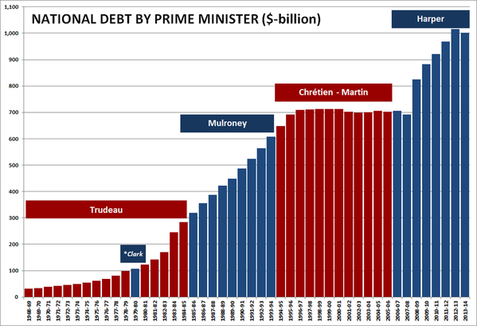

# The Harper Decade

## Abstract

Stephen Harper, the current Prime Minister of Canada, assumed office on February 6, 2006. Chief amongst his themes is the Economy. However, under his government–as well as other Conservative governments–the economy has not gone so well.

This project simply aims to create a visual chart of the value of the Canadian dollar versus the American dollar during the Harper office, and put that in parallel with the chart below, which outlines the state of national debt during each office.

Source to be determined.

## Other resources

- [Canada's deficits and surpluses, 1963-2014](http://www.cbc.ca/news2/interactives/canada-deficit/)
- [6 charts show Stephen Harper has the worst economic record of any Prime Minister since World War II](http://www.pressprogress.ca/6_charts_show_stephen_harper_has_the_worst_economic_record_of_any_prime_minister_since_world_war_ii)